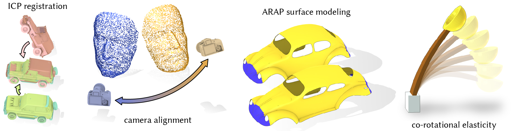

# Fast Updates for Least-Squares Rotational Alignment


Public code release for the paper [Fast Updates for Least-Squares Rotational Alignment](https://www.dgp.toronto.edu/projects/fast-rotation-fitting/) by Jiayi Eris Zhang, Alec Jacobson and Marc Alexa.

## Files
+ `src/`: source code
    + `eigen_svd.h`
    + `horneig.h`
    + `FA3R.h`
    + `MBCM.h`
    + `mcadams.h` and `Singular_Vaule_Decomposition/`

+ `cmake/` and `CMakeLists.txt`: CMake files
+ `benchmarking.cpp`: benchmarking script

## Installation
We have successfully validated this installation on a variety of compilers, CPU setups, and operating systems (e.g., Linux, Mac, Windows).  Note that the actual performance of different algorithms will depend on the specific implementation, the hardware, and the
data (i.e. the cross-correlation matrix). A central and long-term
contribution of our work is the implementation of many different algorithms in one framework. This allows users to select the
best algorithm for their platform and their data distribution. It
also fosters continuing development of rigid alignment algorithms


To get started, please start by cloning the repository recursively
```
git clone --recursive https://github.com/ErisZhang/fast-rotation-fitting.git
```
Then to build the project, issue
```
mkdir build
cd build
cmake -DCMAKE_BUILD_TYPE=Release ..
make -j4
```

